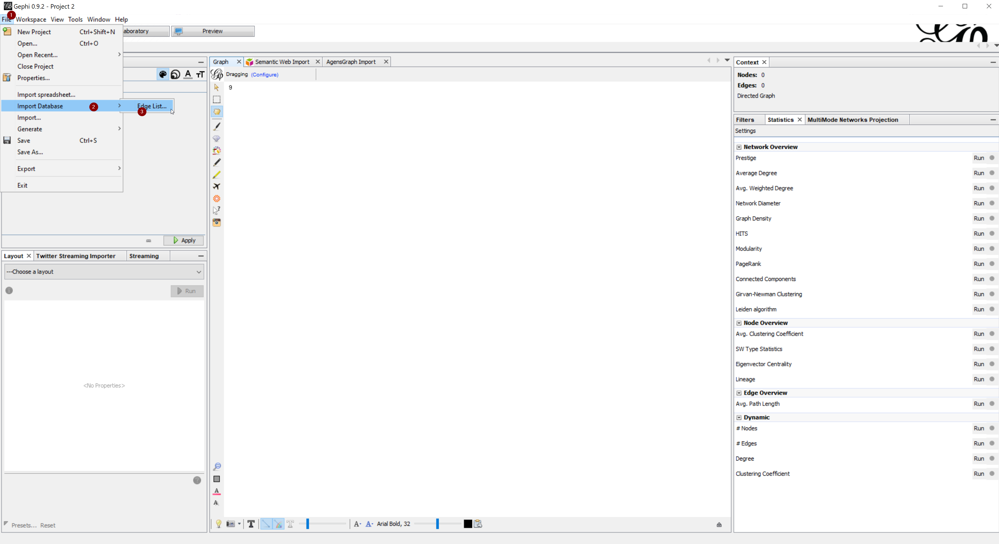
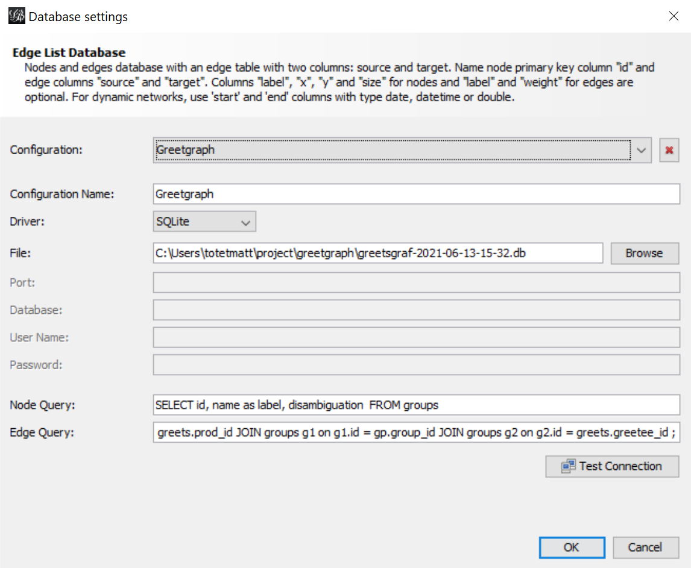
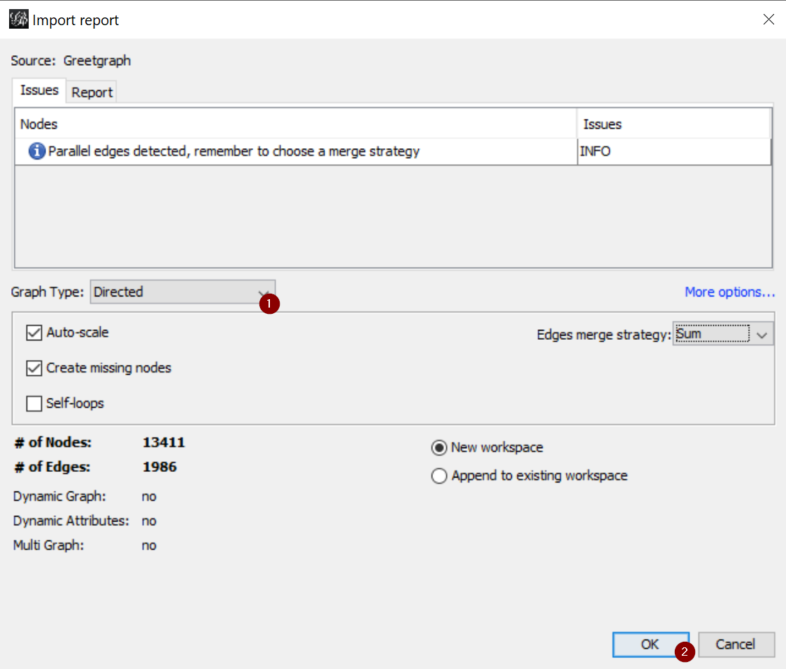
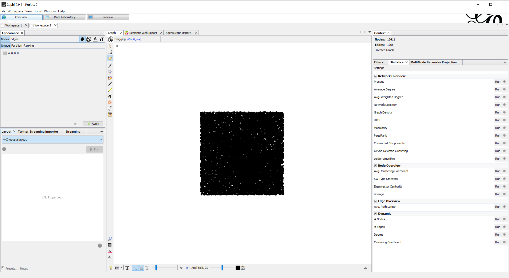
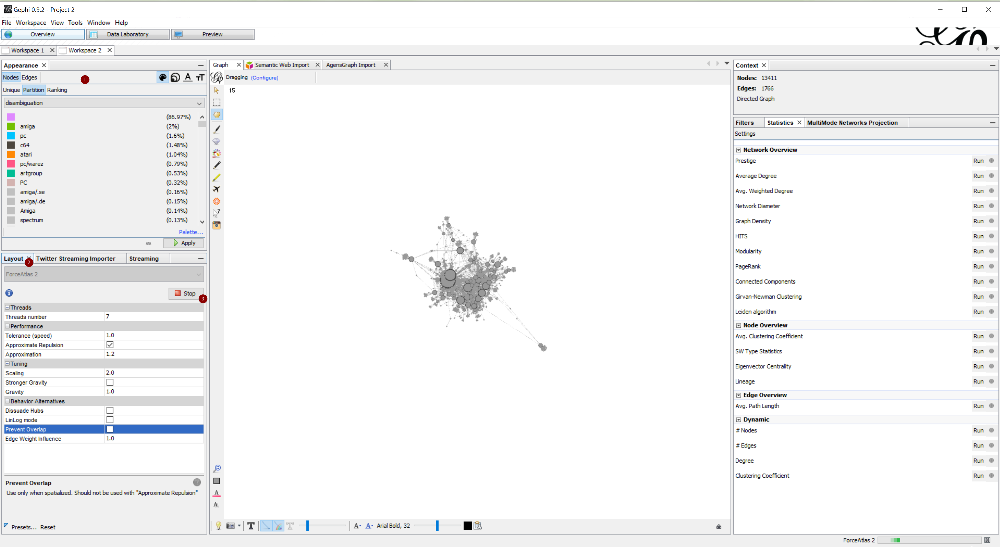

# How to visualise locally the Greet Graf

This is a simple tuto that try to explain how to use Gephi to visualise the Greet Graf.

# Get Gephi

Download the latest version in https://gephi.org/ .

# Get Latest version of database

The history and latest version are available here : https://greetsgraf.jetlag.group/_data/

# Import the GreetGraph to Gephi

- Open Gephi and create a **New Project**
- Go to **File** >> \*\*
  

- Configure like this

  - **Configuration Name**: Put any name, it's just to keep the configuration for next time.
  - **Driver** : SQLite
  - **File** : Path of the `greetgraf.db` file you downloaded before
  - **Node query**

  ```sql
  SELECT id, name as label, disambiguation  FROM groups
  ```

  - **Edge Query**

  ```sql
  SELECT g1.id as source , g2.id as target FROM greets JOIN group_prods gp ON gp.prod_id = greets.prod_id JOIN groups g1 on g1.id = gp.group_id JOIN groups g2 on g2.id = greets.greetee_id ;
  ```

Notes : If you find other or better way to query the data, adapt, improvise, overcome.

- Click **Ok**
  

Next Windows:

- **Graph Type** : Directed
- Click **Ok**
  

It should result to this



# Play with the graph



# Exemple with sime time spend on it


